## 1.
# Proyectos ejercicios arreglos y metodos

---

## 2. INFORMACION DEL ESTUDIANTE
**Nombre Completo:** Jesús David Tovar Rojas
**Programa Academico:** Tecnologia en desarrollo de software
**Fecha de Entrega:** 17/09/2026

---

## 3. EVIDENCIAS
 - captura de pantalla de los ejercicios:
### Ejercicio 1
>4.a.2. Hacer un bucle que pida por teclado 10 números enteros y los almacene en un array, y que se calcule posteriormente la suma de los números que sean pares y la suma de los números que sean impares, y que nos diga por pantalla cual de las dos sumas es mayor.

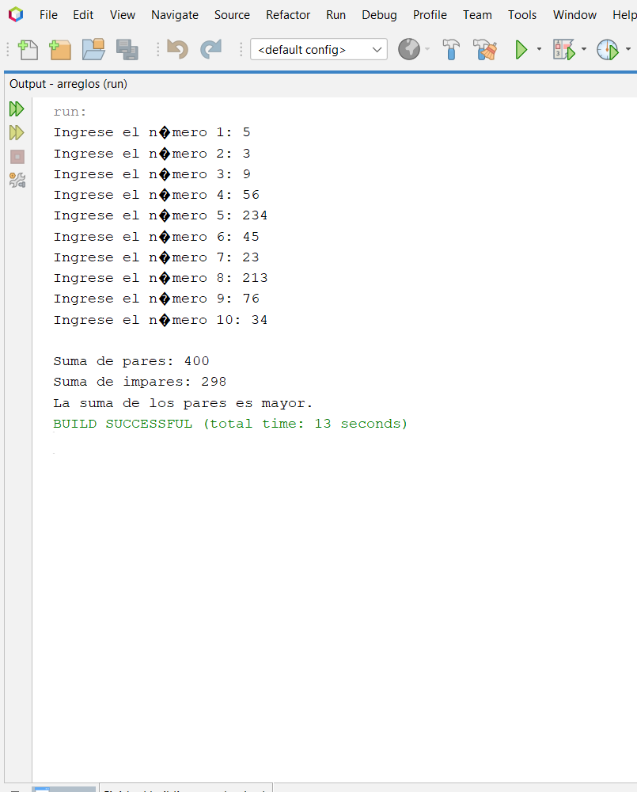
### Ejercicio 2
>4.a.6. Pedir por teclado las notas de 8 estudiantes y guardarlas en un array de notas. Las notas serán números decimales. Tras leer las notas en un bucle inicial, procesar en otro bucle la información y mostrar por pantalla:

1. la nota más alta
2. la nota más baja
3. la nota media de todas las notas
4. el número de aprobados
5. el número de suspensos.

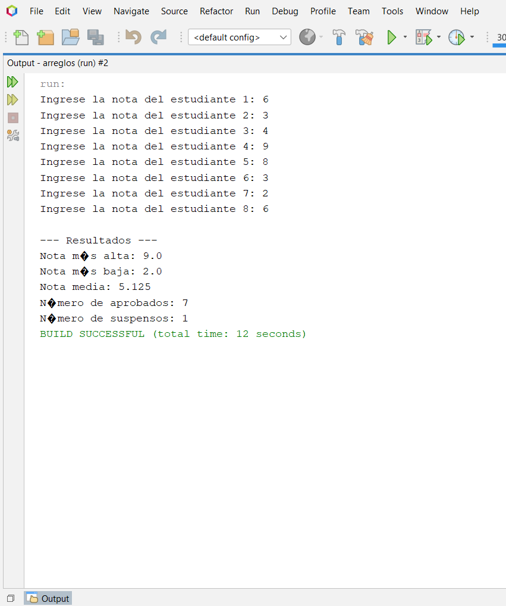

### Ejercicio 3
>4.a.9. Crear un array de números de un tamaño pasado por teclado. Rellenar el array con números aleatorios entre 1 y 100. Mostrar aquellos números del array que sean múltiplos de otro número, que nosotros le debemos indicar por teclado

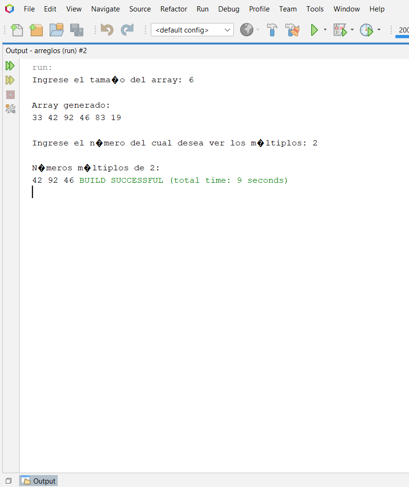

### Ejercicio 4
>4.a.10.Realiza un programa que pida por teclado 10 números enteros y los almacene en un array. Posteriormente, nos dice si hay dos números iguales seguidos, esto es, si alguna posición del array que tenga el mismo número que la posición siguiente del array.

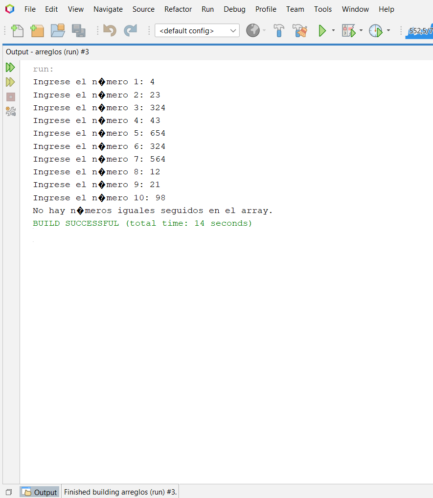

### Ejercicio 5
>4.a.11. Escribe un programa que pida al usuario rellenar un array de enteros. Después le pide por teclado
dos números, el límite y el valor de sustitución. El programa debe sustituir, por el valor de sustitución,
todos los valores del array que estén por encima del límite. Finalmente debe mostrar el array resultado.
Ejemplo:
Array: 2 5 34 53 2 -2
Límite: 3
Sustitución: 0
Resultado: 2 0 0 0 2 -2

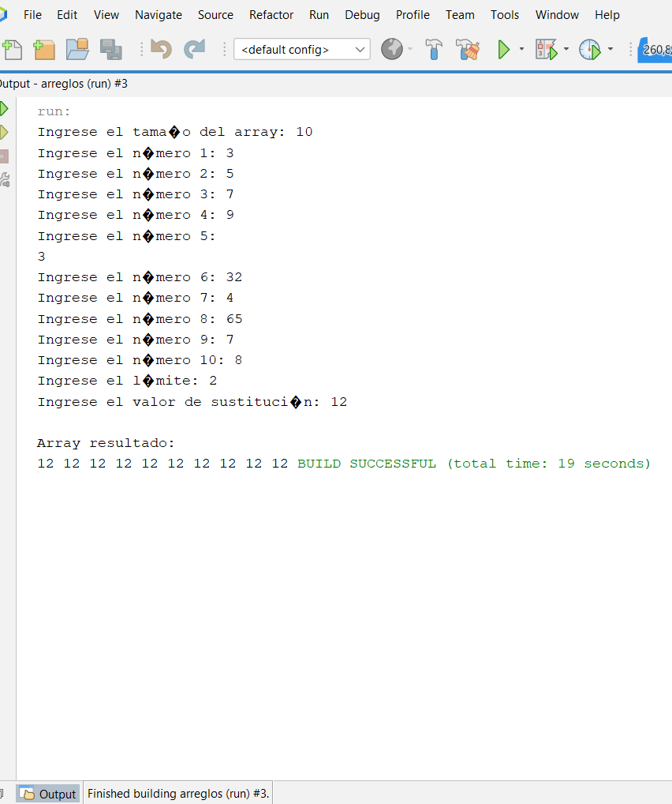

### Ejercicio 6
>4.a.15.Crear un array con 20 elementos de modo que los elementos de índice par tengan como valor 0 y las de índice impar 1. Se pinta luego el array, pero mostrando 5 números por línea

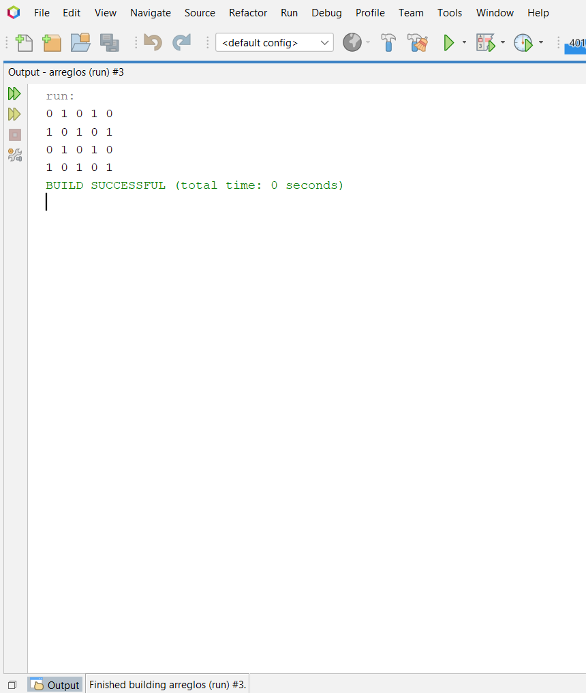

### Ejercicio 7
>4.a.22.Rellenar aleatoriamente un array de 5 números enteros, y posteriormente indicar si los números están ordenados de forma creciente, decreciente, o si están desordenados.

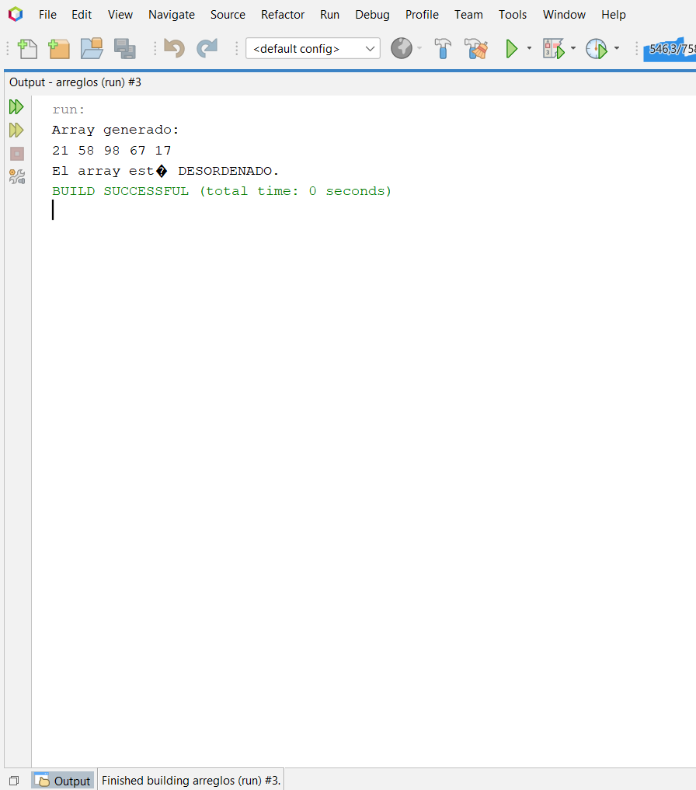

### Ejercicio 8
>5.b.3. Crear un método que recibe una matriz de enteros, y devuelve un array con la media de los valores de cada fila de la matriz. Crear una clase Prueba con un main que llame y compruebe el funcionamiento del método anterior.

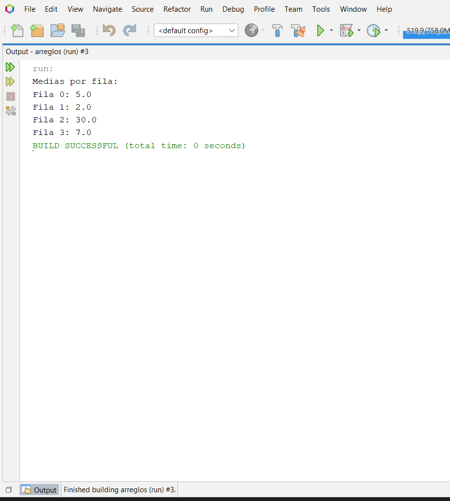

### Ejercicio 9
>5.b.6. Realizar un método que reciba un array de números enteros y devuelva un array que tenga sólo uno de cada 10 números del array original. Es decir, si el array original tiene 43 casillas el array devuelto tendrá 5 con los valores de la casilla 0, la 10, la 20, la 30 y la 40;

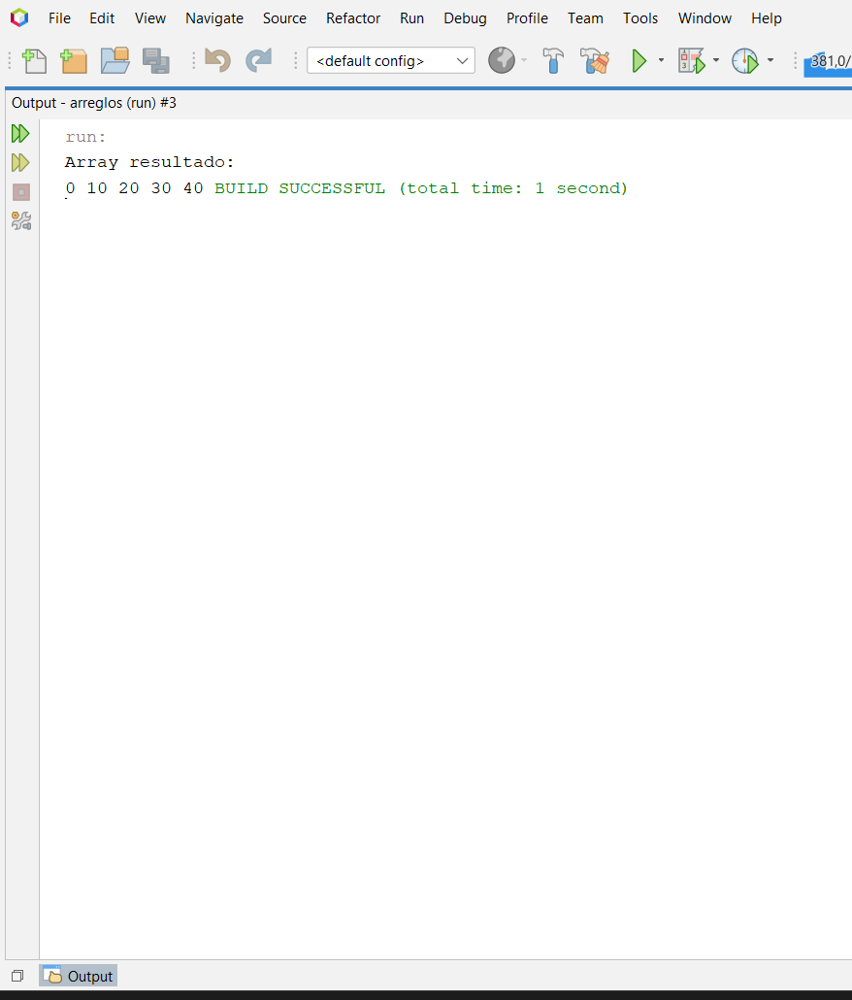

### Ejercicio 10
>5.c.4. Crear un método que muestre en binario un número entre 0 y 255

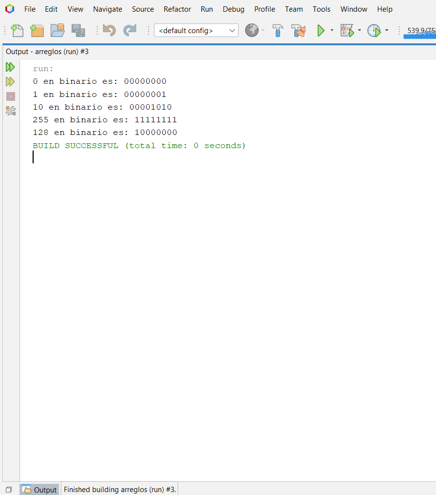

### Ejercicio de la evaluacion hecha a estudiantes 2025-2
> este texto es dado por el profesor y es muy largo entonces no mejor revisar el documento enviado al classroom

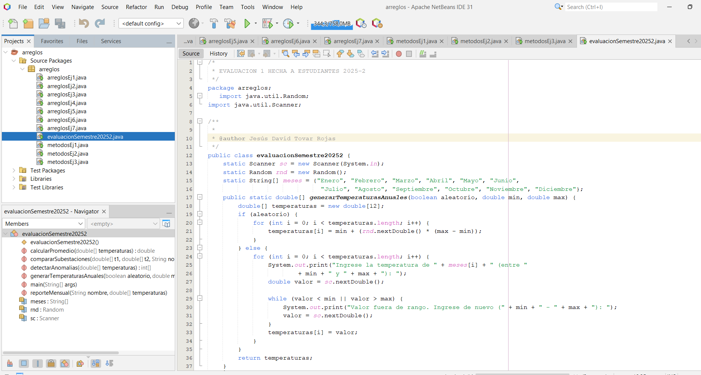

## Conclusiones
Estuvo muy complicado, dificilmente pude hacer algunos, aunque me ayude con la ia no pude resolver la evaluacion hecha a estudiantes del 2025-2

}
